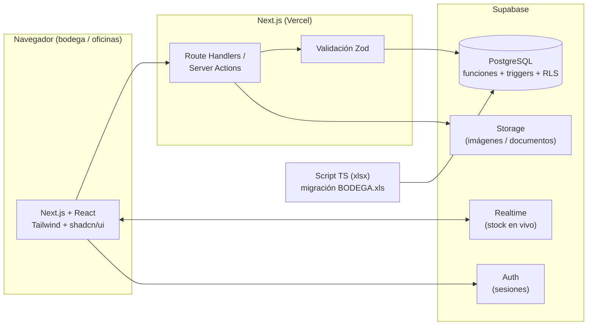
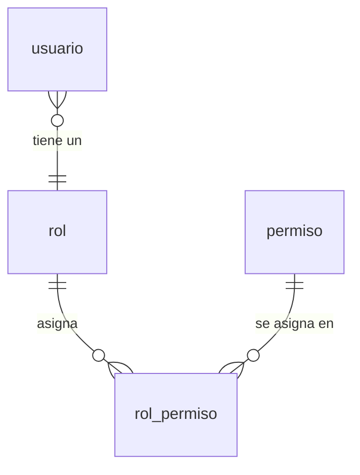
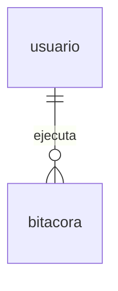
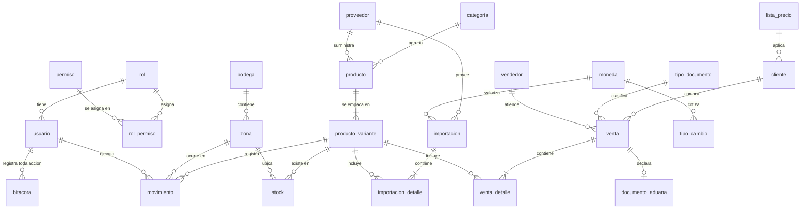

# BACKEND — Arquitectura y modelo de datos

> **Este proyecto se construye con buenas prácticas de desarrollo desde el día uno.**
> El MVP es solo la primera entrega: el sistema quedará operando el inventario real de la empresa. Cada decisión de modelo, cada migración y cada endpoint debe escribirse pensando en que otra persona lo mantendrá dentro de dos años. Ver [Buenas prácticas](#buenas-prácticas-obligatorias) al final de este documento.

---

## 1. Diagrama general



La lógica crítica de inventario (todo lo que afecta stock) vive **en la base de datos** como funciones y triggers. Nunca en el cliente. Así el stock es consistente aunque haya varios usuarios operando a la vez, y aunque mañana se agregue otro frontend o una app móvil.

---

## 2. Hallazgos del análisis de datos del cliente

El modelo no se diseñó "en abstracto": se derivó de `BODEGA.xls` (13 hojas, 2.528 filas de producto), de `COTIZACION.xlsx` (nota de venta real) y de las capturas del software Galpón. Estos hallazgos condicionan los atributos:

| #   | Hallazgo en los datos reales                                                                                                                                    | Impacto en el modelo                                                                                                     |
| --- | --------------------------------------------------------------------------------------------------------------------------------------------------------------- | ------------------------------------------------------------------------------------------------------------------------ |
| 1   | **Un producto está repartido en varias zonas con cantidad**: 179 de 242 valores de 区域 son compuestos, ej. `1-3 (2)M3(1)` = 2 cajas en zona 1-3 y 1 caja en M3 | `stock` es por **producto + zona**, nunca un único campo en `producto`. La migración necesita un parser de estas cadenas |
| 2   | **Códigos repetidos con distinto empaque**: `LB23020` existe con 1200 y con 600 piezas/caja; `F275D-1` con 24 y 12 pares                                        | Se separa `producto` (código de fábrica) de `producto_variante` (empaque). Esto resuelve MAE-02                          |
| 3   | **Códigos repetidos idénticos**: `80013`, `308`, `80011` aparecen 3 veces con los mismos datos                                                                  | Son duplicados de digitación. La migración los consolida sumando cantidades y deja constancia                            |
| 4   | **Códigos numéricos**: `80013`, `308`, `2012`                                                                                                                   | `codigo` es `text`, nunca numérico. Se normaliza con `trim` (hay zonas como `'M2-4 '` con espacio final)                 |
| 5   | **Dos unidades distintas**: calzado usa 双数 (pares), ropa usa 件数 (piezas)                                                                                    | `unidad_medida` a nivel de producto (`PAR` / `PIEZA` / `JUEGO`), no hardcodeado                                          |
| 6   | **Tallas heterogéneas**: `31-36`, `M-2XL`, `3XL-7XL`, `8+16`, `T2015`, y erratas como `38*42` o `2530`                                                          | `rango_tallas` se guarda como texto (fuente de verdad) + `talla_desde`/`talla_hasta` opcionales para filtrar             |
| 7   | **Salidas registradas por día (col. 1–31) y consolidadas por mes (hojas 统计)**                                                                                 | No se replican columnas por día: se modela `movimiento` con fecha real; los reportes mensuales son agregaciones          |
| 8   | **Existencia = 入库 − 出库** y los totales cuadran con la hoja 汇总 (35.042 / 19.167)                                                                           | Regla de negocio verificada. El script de migración valida contra estos totales                                          |
| 9   | **La nota de venta maneja 3 unidades a la vez**: cajas, pares y unidades totales, con precio unitario y precio por docena (`9,583333 × 12 = 115`)               | `detalle_venta` guarda cajas, unidades y `precio_unitario`; el precio por docena es derivado                             |
| 10  | **Clientes bolivianos** (La Paz, Santa Cruz) comprando en USD desde ZOFRI                                                                                       | `cliente` necesita país, ciudad, documento genérico (RUT o pasaporte) y "marca" de embarque                              |
| 11  | Galpón distingue **Cliente** y **"Facturar a"** (razón social distinta)                                                                                         | `venta` tiene `cliente_id` y `facturar_a_id` separados                                                                   |
| 12  | Galpón maneja **folio correlativo por año** (`202600784`) y **código de visación** de Aduanas                                                                   | Tablas `correlativo` y `documento_aduana`                                                                                |
| 13  | Tipo de cambio del día: Dólar 910,29 · Euro 1.048,84 · UF 40.746,28 · UTM 71.506                                                                                | `tipo_cambio` con histórico por fecha; los documentos **congelan** el tipo de cambio usado                               |
| 14  | La línea de detalle en Galpón tiene columna **ZETA** (ubicación declarada ante ZOFRI)                                                                           | Maestro `ubicacion_zeta`, distinto de la zona física interna                                                             |

---

## 3. Convenciones del esquema

Aplican a **todas** las tablas, sin excepción:

- **Nombres:** `snake_case`, tablas en **singular** (`producto`, no `productos`), FK como `<tabla>_id`.
- **PK:** `bigint generated always as identity` (o `uuid` cuando la fila la crea el cliente). Nunca el código de negocio como PK — los códigos del cliente se repiten y cambian.
- **Timestamps:** toda tabla lleva `created_at timestamptz not null default now()` y `updated_at timestamptz not null default now()` (mantenido por trigger).
- **Trazabilidad:** `created_by uuid references usuario(id)` y `updated_by` en toda tabla operativa; además **toda** tabla lleva trigger de [bitácora](#42-bitácora--toda-acción-queda-registrada-adm-02).
- **Borrado lógico:** `activo boolean not null default true` en maestros. **Nunca `DELETE`** sobre datos con historial.
- **Dinero:** `numeric(14,4)`. **Jamás `float`/`double`** — genera descuadres de centavos.
- **Cantidades:** `numeric(14,2)` con `check (... >= 0)` donde corresponda.
- **Texto:** `text` (no `varchar(n)`), con `check` cuando hay dominio cerrado.
- **Enums:** tipos `enum` de PostgreSQL para dominios estables (`tipo_movimiento`), tabla maestra para los que el usuario administra (`tipo_documento`).
- **Integridad en la BD:** `not null`, `unique`, `check` y FK explícitas. La validación de Zod en la app es una capa **adicional**, no un reemplazo.

---

## 4. Modelo de datos

### 4.1 Seguridad y acceso

Un **usuario** tiene un **rol**, y ese rol agrupa **muchos permisos**. Como un permiso pertenece a varios roles, la relación es muchos-a-muchos y se resuelve con la tabla intermedia `rol_permiso`:



| Tabla         | Descripción                                              | Atributos                                                                            |
| ------------- | -------------------------------------------------------- | ------------------------------------------------------------------------------------ |
| `usuario`     | Operador del sistema (extiende `auth.users` de Supabase) | id (uuid, FK auth.users), nombre, email, rol_id, activo, ultimo_acceso               |
| `rol`         | Perfil de acceso                                         | id, nombre, descripcion, activo                                                      |
| `permiso`     | Acción concreta sobre un módulo                          | id, codigo (`producto.crear`), modulo, descripcion                                   |
| `rol_permiso` | **Intermedia** rol ⇄ permiso                             | rol_id, permiso_id (PK compuesta)                                                    |
| `bitacora`    | Registro de toda acción de usuario — ver § 4.2           | id, **usuario_id**, usuario_email, tabla, registro_id, accion, campos_modificados, … |

```sql
create table rol (
  id          bigint generated always as identity primary key,
  nombre      text    not null unique,
  descripcion text,
  activo      boolean not null default true,
  created_at  timestamptz not null default now(),
  updated_at  timestamptz not null default now()
);

create table permiso (
  id          bigint generated always as identity primary key,
  codigo      text not null unique,          -- 'producto.crear', 'movimiento.anular'
  modulo      text not null,                 -- 'maestros' | 'inventario' | 'compras' | 'ventas' | 'reportes' | 'admin'
  descripcion text not null
);

create table rol_permiso (
  rol_id     bigint not null references rol(id)     on delete cascade,
  permiso_id bigint not null references permiso(id) on delete cascade,
  primary key (rol_id, permiso_id)
);

create table usuario (
  id            uuid primary key references auth.users(id) on delete cascade,
  nombre        text    not null,
  email         text    not null unique,
  rol_id        bigint  not null references rol(id),
  activo        boolean not null default true,
  ultimo_acceso timestamptz,
  created_at    timestamptz not null default now(),
  updated_at    timestamptz not null default now()
);
```

Para cambiar lo que puede hacer un perfil se editan filas de `rol_permiso`: sin tocar código y sin reasignar usuarios uno por uno (ADM-01).

**La verificación ocurre en la base de datos**, no solo en la interfaz. La función `tiene_permiso()` resuelve la cadena completa para el usuario autenticado y se usa dentro de las políticas RLS:

```sql
create or replace function tiene_permiso(p_codigo text)
returns boolean language sql stable security definer
set search_path = public as $$
  select exists (
    select 1
      from usuario u
      join rol_permiso rp on rp.rol_id = u.rol_id
      join permiso p      on p.id = rp.permiso_id
     where u.id = auth.uid()
       and u.activo
       and p.codigo = p_codigo
  );
$$;

alter table producto enable row level security;

create policy "ver productos" on producto
  for select to authenticated using (tiene_permiso('producto.ver'));

create policy "crear productos" on producto
  for insert to authenticated with check (tiene_permiso('producto.crear'));
```

### 4.2 Bitácora — toda acción queda registrada (ADM-02)

**Regla del proyecto: cada acción que hace un usuario se registra en `bitacora`, con su `usuario_id`.** No hay excepciones, y no depende de que el programador se acuerde de escribir el registro: lo hacen **triggers en la base de datos**, así que es imposible modificar un dato sin dejar rastro.



| Columna              | Tipo                    | Para qué                                                                |
| -------------------- | ----------------------- | ----------------------------------------------------------------------- |
| `usuario_id`         | `uuid` → FK a `usuario` | **Quién.** Lo toma el trigger con `auth.uid()`                          |
| `usuario_email`      | `text`                  | Email congelado: el rastro sobrevive aunque el usuario se dé de baja    |
| `created_at`         | `timestamptz`           | **Cuándo**                                                              |
| `tabla`              | `text`                  | **Dónde**: sobre qué tabla se actuó                                     |
| `registro_id`        | `text`                  | Qué fila concreta (soporta claves compuestas como `rol_permiso`)        |
| `accion`             | `text`                  | **Qué**: `INSERT`, `UPDATE`, `DELETE`, `LOGIN`, `EXPORTAR`, `ANULAR`, … |
| `modulo`             | `text`                  | Módulo de la aplicación, para filtrar                                   |
| `datos_antes`        | `jsonb`                 | La fila completa **antes** del cambio                                   |
| `datos_despues`      | `jsonb`                 | La fila completa **después** del cambio                                 |
| `campos_modificados` | `text[]`                | Solo las columnas que realmente cambiaron, para leer rápido             |
| `descripcion`        | `text`                  | Texto libre, para acciones de aplicación                                |
| `ip` / `user_agent`  | `inet`/`text`           | Desde dónde se hizo                                                     |

```sql
create table bitacora (
  id                 bigint generated always as identity primary key,
  usuario_id         uuid references usuario(id),          -- QUIEN hizo el cambio
  usuario_email      text not null default 'sistema',
  tabla              text,
  registro_id        text,
  accion             text not null,
  modulo             text,
  descripcion        text,
  datos_antes        jsonb,
  datos_despues      jsonb,
  campos_modificados text[],
  ip                 inet,
  user_agent         text,
  created_at         timestamptz not null default now()
);
```

**Cómo se llena.** Un trigger `after insert or update or delete` en cada tabla llama a `fn_bitacora()`, que resuelve el usuario con `auth.uid()`, guarda el antes y el después, y calcula qué columnas cambiaron:

```sql
create trigger tr_bitacora_producto
  after insert or update or delete on producto
  for each row execute function fn_bitacora();

-- Tablas con clave compuesta: se le indican las columnas que identifican la fila
create trigger tr_bitacora_rol_permiso
  after insert or update or delete on rol_permiso
  for each row execute function fn_bitacora('rol_id', 'permiso_id');
```

**Tablas cubiertas:** `rol`, `permiso`, `rol_permiso`, `usuario`, `moneda`, `tipo_cambio`, `categoria`, `proveedor`, `bodega`, `zona`, `ubicacion_zeta`, `producto`, `producto_variante` y `movimiento`.

> `stock` no lleva trigger a propósito: ningún usuario la escribe, la deriva el trigger del movimiento. Su historia **es** el kardex.

**Acciones que no son cambios de tabla** (inicio de sesión, exportar un reporte, imprimir un documento) se registran desde la aplicación con:

```sql
select registrar_en_bitacora('LOGIN', 'admin', 'Inicio de sesión');
select registrar_en_bitacora('EXPORTAR', 'reportes', 'Resumen por categoría a Excel');
```

**Garantías:**

- **Append-only.** Triggers que rechazan `UPDATE` y `DELETE` sobre `bitacora`. Una bitácora que se puede editar no sirve como evidencia de nada.
- **No se puede evadir.** Al vivir en la base de datos, registra igual si el cambio viene de la web, de un script o del panel de Supabase.
- **Ruido controlado.** Si un `UPDATE` solo tocó `updated_at`, no se registra.
- **Visibilidad por RLS.** Cada usuario ve **su propia** actividad; ver la de los demás exige el permiso `bitacora.ver`.

```sql
create policy bitacora_lectura on bitacora
  for select to authenticated
  using (usuario_id = auth.uid() or tiene_permiso('bitacora.ver'));
```

La vista `v_bitacora` resuelve el nombre y el rol del usuario para consultarla sin hacer joins a mano.

### 4.3 Catálogo (MAE-01 a MAE-04)

| Tabla               | Descripción                                                  | Atributos                                                                                                                                                                                       |
| ------------------- | ------------------------------------------------------------ | ----------------------------------------------------------------------------------------------------------------------------------------------------------------------------------------------- |
| `categoria`         | Niño (童鞋), Juvenil, Adulto (男鞋), Ropa (服装) — ampliable | id, codigo, nombre_es, nombre_zh, unidad_medida_default, activo                                                                                                                                 |
| `producto`          | Artículo de fábrica (货号)                                   | id, codigo, categoria_id, descripcion_es, descripcion_zh, rango_tallas (码段), talla_desde, talla_hasta, unidad_medida, marca, genero, temporada, proveedor_id, imagen_url, activo, observacion |
| `producto_variante` | Presentación/empaque del artículo (双数 / 件数)              | id, producto_id, unidades_por_caja, codigo_barras, sku_interno, stock_minimo, activo                                                                                                            |
| `zona`              | Ubicación física en bodega (区域)                            | id, codigo, descripcion, bodega_id, tipo, activo                                                                                                                                                |
| `bodega`            | Recinto (Iquique, Arica)                                     | id, codigo, nombre, direccion, activo                                                                                                                                                           |
| `ubicacion_zeta`    | Ubicación declarada ante ZOFRI (columna ZETA de Galpón)      | id, codigo, descripcion, activo                                                                                                                                                                 |

```sql
create table producto (
  id            bigint generated always as identity primary key,
  codigo        text   not null,                 -- 货号 · SIEMPRE text: hay códigos como '80013'
  categoria_id  bigint not null references categoria(id),
  descripcion_es text,
  descripcion_zh text,                           -- soporte bilingüe (RNF)
  rango_tallas  text,                            -- 码段 tal como viene: '31-36', 'M-2XL', '8+16'
  talla_desde   text,                            -- derivado, para filtrar
  talla_hasta   text,
  unidad_medida unidad_medida not null default 'PAR',   -- PAR (双数) | PIEZA (件数) | JUEGO
  marca         text,
  genero        text,
  temporada     text,
  proveedor_id  bigint references proveedor(id),
  imagen_url    text,
  observacion   text,
  activo        boolean not null default true,
  created_at    timestamptz not null default now(),
  updated_at    timestamptz not null default now(),
  created_by    uuid references usuario(id),
  updated_by    uuid references usuario(id),
  constraint producto_codigo_categoria_uk unique (codigo, categoria_id)
);

create table producto_variante (
  id               bigint generated always as identity primary key,
  producto_id      bigint not null references producto(id),
  unidades_por_caja numeric(10,2) not null check (unidades_por_caja > 0),  -- 双数/件数
  codigo_barras    text unique,                  -- para INV-08 (código de barras/QR)
  sku_interno      text unique,
  stock_minimo     numeric(14,2) default 0,      -- para INV-05 (alertas)
  activo           boolean not null default true,
  created_at       timestamptz not null default now(),
  updated_at       timestamptz not null default now(),
  constraint variante_uk unique (producto_id, unidades_por_caja)
);
```

> **Por qué `producto_variante`:** en los datos reales `LB23020` viene en cajas de 1200 y de 600 piezas, y `F275D-1` en cajas de 24 y de 12 pares. Es el mismo artículo con distinto empaque. Sin esta tabla el código sería ambiguo y el stock se descuadraría. El stock y los movimientos apuntan a la **variante**, nunca al producto.

### 4.4 Inventario (INV-01 a INV-07)

| Tabla                       | Descripción                             | Atributos                                                                                                                          |
| --------------------------- | --------------------------------------- | ---------------------------------------------------------------------------------------------------------------------------------- |
| `stock`                     | Existencia por variante y zona          | id, variante_id, zona_id, cajas, unidades, updated_at                                                                              |
| `movimiento`                | Kardex append-only                      | id, variante_id, zona_id, tipo, cajas, unidades, saldo_cajas, documento_tipo, documento_id, motivo, fecha, usuario_id, anulado_por |
| `inventario_fisico`         | Cabecera de toma de inventario (INV-06) | id, fecha, bodega_id, estado, usuario_id, observacion                                                                              |
| `inventario_fisico_detalle` | Conteo por variante y zona              | id, inventario_id, variante_id, zona_id, cajas_sistema, cajas_contadas, diferencia                                                 |

```sql
create type tipo_movimiento as enum
  ('ENTRADA','SALIDA','AJUSTE_POSITIVO','AJUSTE_NEGATIVO','TRASPASO_SALIDA','TRASPASO_ENTRADA');

create table stock (
  id          bigint generated always as identity primary key,
  variante_id bigint not null references producto_variante(id),
  zona_id     bigint not null references zona(id),
  cajas       numeric(14,2) not null default 0 check (cajas >= 0),
  unidades    numeric(14,2) not null default 0 check (unidades >= 0),
  updated_at  timestamptz not null default now(),
  constraint stock_uk unique (variante_id, zona_id)   -- una fila por variante+zona
);

create table movimiento (
  id             bigint generated always as identity primary key,
  variante_id    bigint not null references producto_variante(id),
  zona_id        bigint not null references zona(id),
  tipo           tipo_movimiento not null,
  cajas          numeric(14,2) not null check (cajas > 0),
  unidades       numeric(14,2) not null check (unidades > 0),
  saldo_cajas    numeric(14,2) not null,       -- saldo resultante: kardex auditable
  documento_tipo text,                          -- 'IMPORTACION' | 'VENTA' | 'AJUSTE' | 'TRASPASO' | 'MIGRACION'
  documento_id   bigint,                        -- referencia al documento origen
  motivo         text,
  fecha          timestamptz not null default now(),
  usuario_id     uuid not null references usuario(id),
  anulado_por    bigint references movimiento(id),  -- reverso, nunca DELETE
  created_at     timestamptz not null default now()
);

create index on movimiento (variante_id, fecha desc);   -- kardex (INV-03)
create index on movimiento (documento_tipo, documento_id);
```

> **`movimiento` es append-only.** Un error no se edita ni se borra: se registra un movimiento inverso que apunta al original con `anulado_por`. Es la única forma de que el kardex sea auditable y de que la existencia siempre pueda recalcularse desde cero.

### 4.5 Compras / Importaciones (COM-01 a COM-04)

| Tabla                 | Descripción             | Atributos                                                                                                                                         |
| --------------------- | ----------------------- | ------------------------------------------------------------------------------------------------------------------------------------------------- |
| `proveedor`           | Fabricante en China     | id, codigo, nombre, nombre_zh, pais, contacto, email, telefono, direccion, activo                                                                 |
| `importacion`         | Cabecera de compra      | id, numero, proveedor_id, fecha, fecha_llegada, doc_aduana, moneda_id, tipo_cambio, estado, flete, seguro, gastos_internacion, total, observacion |
| `importacion_detalle` | Ítems de la importación | id, importacion_id, variante_id, cajas, unidades, costo_unitario, costo_total, zona_destino_id                                                    |

```sql
create type estado_documento as enum ('BORRADOR','CONFIRMADO','ANULADO');

create table importacion (
  id                  bigint generated always as identity primary key,
  numero              text not null unique,
  proveedor_id        bigint not null references proveedor(id),
  fecha               date not null,
  fecha_llegada       date,
  doc_aduana          text,                       -- traspaso 203
  moneda_id           bigint not null references moneda(id),
  tipo_cambio         numeric(14,4) not null,     -- congelado al confirmar
  estado              estado_documento not null default 'BORRADOR',
  flete               numeric(14,4) default 0,
  seguro              numeric(14,4) default 0,
  gastos_internacion  numeric(14,4) default 0,    -- COM-04: costo real
  total               numeric(14,4) not null default 0,
  observacion         text,
  created_at timestamptz not null default now(),
  updated_at timestamptz not null default now(),
  created_by uuid references usuario(id)
);
```

> El stock **solo** se afecta al pasar la importación a `CONFIRMADO`. En `BORRADOR` no existe para el inventario. El tipo de cambio se congela en ese momento: si mañana el dólar cambia, el costo histórico no se altera.

### 4.6 Ventas / Despachos (VEN-01 a VEN-05 · Fase 2)

Atributos derivados de la nota de venta real (`COTIZACION.xlsx`) y de la pantalla de Galpón:

| Tabla                                   | Descripción                                                | Atributos                                                                                                                                                                                                      |
| --------------------------------------- | ---------------------------------------------------------- | -------------------------------------------------------------------------------------------------------------------------------------------------------------------------------------------------------------- |
| `cliente`                               | Mayorista (mayoría boliviano)                              | id, codigo, razon_social, nombre_fantasia, documento_tipo, documento_numero, ciudad, pais, direccion, telefono, email, marca_embarque, lista_precio_id, credito_limite, activo                                 |
| `venta`                                 | Nota de venta / factura / traspaso                         | id, folio, tipo_documento_id, fecha, cliente_id, facturar_a_id, vendedor_id, moneda_id, tipo_cambio, forma_pago, estado, destino, bultos, peso_kg, volumen_mt3, subtotal, descuento, total, saldo, observacion |
| `venta_detalle`                         | Ítems vendidos                                             | id, venta_id, item, variante_id, zona_id, ubicacion_zeta_id, cajas, unidades, precio_unitario, precio_docena, total_linea                                                                                      |
| `tipo_documento`                        | Nota de venta, Factura, Traspaso 203, Reexpedición, S.R.F. | id, codigo, nombre, afecta_stock, requiere_aduana, activo                                                                                                                                                      |
| `lista_precio` / `lista_precio_detalle` | Precios por cliente/volumen (VEN-04)                       | id, nombre, moneda_id, vigencia_desde/hasta · variante_id, precio_unitario, cantidad_minima                                                                                                                    |
| `vendedor`                              | Con comisión (VEN-05)                                      | id, usuario_id, nombre, porcentaje_comision, activo                                                                                                                                                            |
| `transportista`                         | Manifiesto de transporte                                   | id, nombre, rut, chofer, patente, telefono, activo                                                                                                                                                             |

```sql
create table venta_detalle (
  id                bigint generated always as identity primary key,
  venta_id          bigint not null references venta(id) on delete cascade,
  item              int    not null,
  variante_id       bigint not null references producto_variante(id),
  zona_id           bigint references zona(id),
  ubicacion_zeta_id bigint references ubicacion_zeta(id),   -- columna ZETA de Galpón
  cajas             numeric(14,2) not null check (cajas > 0),
  unidades          numeric(14,2) not null check (unidades > 0),  -- cajas × unidades_por_caja
  precio_unitario   numeric(14,4) not null check (precio_unitario >= 0),
  total_linea       numeric(14,4) not null,
  constraint venta_detalle_item_uk unique (venta_id, item)
);
```

> `precio_docena` de la planilla es **derivado** (`precio_unitario × 12`), por eso no se almacena: un dato calculable que se guarda es un dato que se desincroniza. Se muestra en la interfaz y en el PDF.

### 4.7 Documentación de Zona Franca (VEN-03)

| Tabla              | Descripción                                     | Atributos                                                                                                                                                                                                                                                                                |
| ------------------ | ----------------------------------------------- | ---------------------------------------------------------------------------------------------------------------------------------------------------------------------------------------------------------------------------------------------------------------------------------------- |
| `documento_aduana` | Traspaso de mercancías (203)                    | id, venta_id, visacion_tipo, visacion_anio, visacion_numero, fecha, aduana_presenta, usuario_nombre, usuario_rut, usuario_direccion, contrato_numero, contrato_fecha, adquiriente_nombre, adquiriente_rut, representante, procedencia, destino, localidad_destino, moneda_codigo, estado |
| `correlativo`      | Folio por tipo de documento y año (`202600784`) | id, tipo_documento_id, anio, ultimo_numero, formato                                                                                                                                                                                                                                      |

### 4.8 Multi-moneda (MAE-06)

| Tabla         | Descripción            | Atributos                                                         |
| ------------- | ---------------------- | ----------------------------------------------------------------- |
| `moneda`      | USD, EUR, UF, UTM, CLP | id, codigo, nombre, simbolo, decimales, activo                    |
| `tipo_cambio` | Histórico diario       | id, moneda_id, fecha, valor, fuente — `unique (moneda_id, fecha)` |

> Todo documento guarda `moneda_id` **y** `tipo_cambio` usados. Consultar la tabla de tipo de cambio al reimprimir un documento antiguo daría un valor distinto al que se firmó.

---

## 5. Diagrama entidad-relación



---

## 6. Reglas de negocio en la base de datos

| Regla                                                | Implementación                                                                                                                    |
| ---------------------------------------------------- | --------------------------------------------------------------------------------------------------------------------------------- |
| Existencia = entradas − salidas (实存 = 入库 − 出库) | Trigger `after insert on movimiento` que hace `upsert` sobre `stock`                                                              |
| Conversión caja ⇄ unidades                           | `unidades = cajas × producto_variante.unidades_por_caja`, calculado en el trigger                                                 |
| No se puede despachar más de lo que hay              | `check (cajas >= 0)` en `stock` + validación previa en la función; la transacción falla antes de descuadrar                       |
| Concurrencia                                         | `select ... for update` sobre la fila de `stock` dentro de la transacción: dos usuarios vendiendo el mismo artículo se serializan |
| Traspaso entre zonas                                 | Una transacción con dos movimientos: `TRASPASO_SALIDA` en origen + `TRASPASO_ENTRADA` en destino                                  |
| Anulación                                            | Movimiento inverso con `anulado_por`. **Nunca `UPDATE` ni `DELETE`** sobre un movimiento                                          |
| Bitácora (ADM-02)                                    | Trigger `fn_bitacora()` en **todas** las tablas: guarda `usuario_id`, acción, antes/después y campos modificados. Append-only     |
| `updated_at`                                         | Trigger `before update` en todas las tablas                                                                                       |
| Autorización                                         | Políticas RLS que consultan `tiene_permiso()` sobre usuario → rol → rol_permiso → permiso                                         |

```sql
create or replace function fn_aplicar_movimiento()
returns trigger language plpgsql as $$
declare
  v_factor numeric(10,2);
  v_signo  int;
begin
  select unidades_por_caja into v_factor
    from producto_variante where id = new.variante_id;

  v_signo := case
    when new.tipo in ('ENTRADA','AJUSTE_POSITIVO','TRASPASO_ENTRADA') then 1
    else -1
  end;

  new.unidades := new.cajas * v_factor;

  insert into stock (variante_id, zona_id, cajas, unidades)
  values (new.variante_id, new.zona_id, v_signo * new.cajas, v_signo * new.unidades)
  on conflict (variante_id, zona_id) do update
    set cajas    = stock.cajas    + excluded.cajas,
        unidades = stock.unidades + excluded.unidades,
        updated_at = now()
  returning cajas into new.saldo_cajas;   -- kardex con saldo resultante

  return new;
end;
$$;
```

---

## 7. Migración desde BODEGA.xls (ADM-04)

El script (`/scripts/migrar-bodega.ts`) no es código desechable: es parte del repositorio, con tests y reporte de resultados.

1. **Leer** las 4 hojas de detalle (`nino`, `juvenli`, `adulto`, `ropa`) detectando columnas **por encabezado** (货号, 双数/件数, 码段, 入库, 出库, 实存, 区域) — las posiciones difieren entre hojas.
2. **Descartar** la fila de totales al pie de cada hoja (入库总数 / 实存总数); si se cuenta como producto, los totales se duplican.
3. **Normalizar** códigos: `trim`, a texto, sin notación numérica (`80013.0` → `80013`).
4. **Parsear zonas compuestas**: `1-3 (2)M3(1)` → 2 cajas en zona `1-3` + 1 caja en `M3`. Lo que no se pueda parsear va a un **reporte de excepciones** para revisión manual, nunca se adivina.
5. **Clasificar códigos repetidos** en tres casos distintos:
   - mismo código + mismo empaque + distinta zona → **no es duplicado**: es stock en dos zonas;
   - mismo código + distinto `unidades_por_caja` → **variante** (`producto_variante`);
   - filas idénticas repetidas → **duplicado de digitación**: se consolida y se deja registro.
6. **Cargar** categorías, zonas, productos, variantes y un movimiento inicial `tipo = 'ENTRADA', documento_tipo = 'MIGRACION'` por cada existencia, para que el kardex arranque con trazabilidad.
7. **Validar** contra la hoja 汇总: 35.042 cajas ingresadas / 19.167 en existencia. **Si no cuadra, la migración falla y hace rollback.**

---

## Buenas prácticas obligatorias

Estas reglas no son opcionales ni "para cuando haya tiempo". El sistema va a operar el inventario real de la empresa.

### Base de datos

- Todo cambio de esquema entra como **migración versionada** en `/supabase/migrations`, con nombre descriptivo y fechada. Nunca se toca el esquema desde el panel de Supabase.
- Las migraciones son **incrementales y reproducibles**: cualquiera debe poder levantar la BD desde cero ejecutándolas en orden.
- Índices en toda FK y en las columnas por las que se filtra (`movimiento(variante_id, fecha)`, `producto(codigo)`).
- RLS **habilitado en todas las tablas**. Una tabla sin política es una tabla pública.
- La `service_role key` nunca llega al navegador. Solo en Server Actions / Route Handlers.

### Código

- **TypeScript en `strict`**. `any` prohibido; si es inevitable, va comentado y justificado.
- Tipos de la BD **generados** (`supabase gen types typescript`), no escritos a mano.
- **Zod** valida toda entrada en el borde (formularios y API). La validación de la BD es la última línea, no la única.
- Sin lógica de negocio en los componentes React: vive en `/lib` o en la BD.
- Sin números mágicos ni valores quemados (docenas, categorías, IVA): van a constantes o a tablas maestras.
- **Nada de secretos en el repositorio.** Variables de entorno y `.env.example` documentado.

### Proceso

- **Ninguna escritura directa a `main`.** Rama por funcionalidad + Pull Request revisado.
- Commits con [Conventional Commits](https://www.conventionalcommits.org/) (`feat:`, `fix:`, `refactor:`, `docs:`).
- CI en GitHub Actions: lint + typecheck + tests. **Si el CI falla, no se mergea.**
- ESLint + Prettier configurados; el formato no se discute en la revisión.
- Documentación viva: si un cambio altera el modelo o un flujo, se actualiza este archivo en el **mismo** PR.

### Pruebas

- Tests unitarios de la lógica de conversión, costeo y precios.
- Tests de integración sobre las funciones de stock: entrada, salida, ajuste, traspaso, anulación y **concurrencia** (dos ventas simultáneas del mismo artículo).
- El script de migración se prueba contra una copia real de `BODEGA.xls` y valida totales.

### Operación

- Respaldos automáticos de Supabase verificados (un respaldo que nunca se restauró no es un respaldo).
- Entornos separados: `dev` → `staging` → `producción`. **Jamás se prueba en producción.**
- Errores registrados con contexto; sin datos sensibles en los logs.
