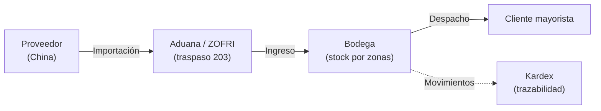
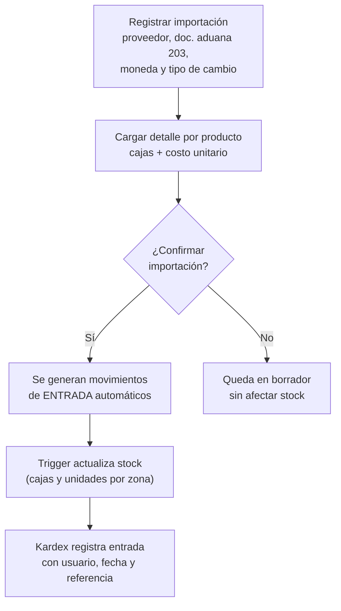
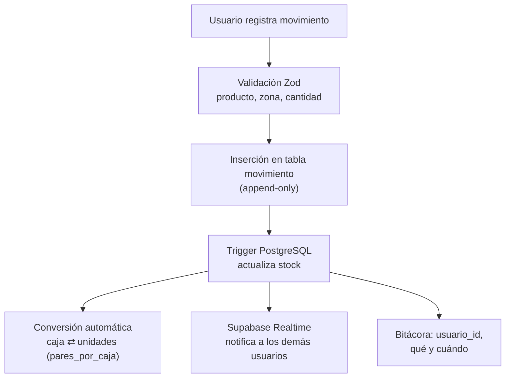
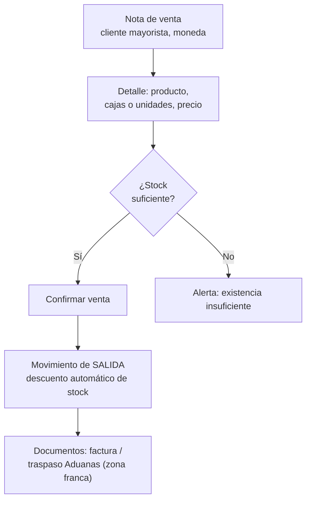
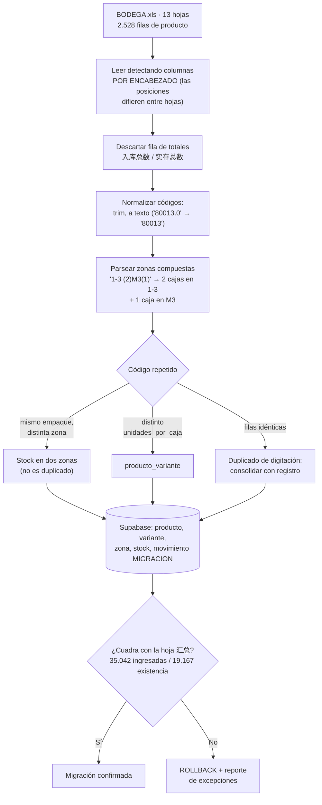
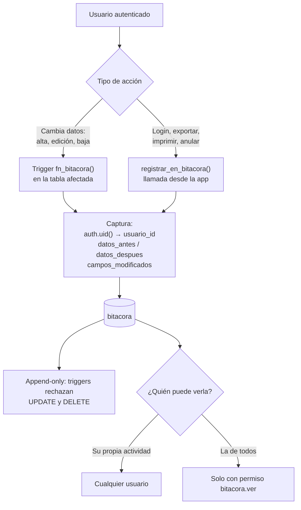
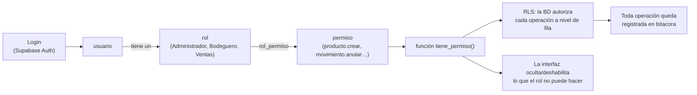

# FLUJO — Procesos del sistema

Flujos operativos del Sistema de Gestión e Inventario, derivados de la operación actual (Galpón + BODEGA.xls) y de los requerimientos del [PRD](PRD_REQUERIMIENTOS.md).

## 1. Flujo general de la operación

## 2. Flujo de compras / importaciones (COM-01 a COM-04)

## 3. Flujo de inventario / bodega (INV-01 a INV-07)

**Movimiento de stock** (entrada, salida, ajuste o traspaso):

**Reglas:**

- Existencia = entradas − salidas (regla heredada de BODEGA.xls: 实存 = 入库 − 出库).
- Todo movimiento queda en el kardex; nada se edita ni borra físicamente.
- Traspasos entre zonas/bodegas (ej. Arica–Iquique) generan salida en origen y entrada en destino.
- Toma de inventario físico → diferencias se registran como movimientos de AJUSTE.

## 4. Flujo de ventas / despachos (VEN-01 a VEN-03 · Fase 2)

## 5. Flujo de migración inicial (ADM-04)

Lo que no se pueda parsear va a un **reporte de excepciones** para revisión manual: nunca se adivina un dato de inventario.

## 6. Flujo de la bitácora (ADM-02)

**Toda acción que hace un usuario se registra en la tabla `bitacora`, con su `usuario_id`.** No depende de que el programador se acuerde de escribirlo: lo hacen triggers en la base de datos, así que no hay forma de modificar un dato sin dejar rastro.

**Qué guarda cada registro:**

| Dato        | Columna                                                                |
| ----------- | ---------------------------------------------------------------------- |
| Quién       | `usuario_id` (FK a `usuario`) + `usuario_email` congelado              |
| Cuándo      | `created_at`                                                           |
| Qué acción  | `accion`: `INSERT`, `UPDATE`, `DELETE`, `LOGIN`, `EXPORTAR`, `ANULAR`… |
| Sobre qué   | `tabla` + `registro_id`                                                |
| Qué cambió  | `datos_antes`, `datos_despues` y `campos_modificados`                  |
| Desde dónde | `ip`, `user_agent`                                                     |

**Tablas cubiertas:** las 14 tablas operativas (`rol`, `permiso`, `rol_permiso`, `usuario`, `moneda`, `tipo_cambio`, `categoria`, `proveedor`, `bodega`, `zona`, `ubicacion_zeta`, `producto`, `producto_variante`, `movimiento`). `stock` queda fuera a propósito: ningún usuario la escribe, la deriva el trigger del movimiento.

**Si un usuario se da de baja**, su bitácora permanece: el email queda congelado en cada registro, así que el rastro sobrevive.

## 7. Flujo de usuario y seguridad (ADM-01, ADM-02)

Cada **usuario** tiene un **rol**, y ese rol acumula **muchos permisos** a través de la tabla intermedia `rol_permiso`. Los permisos no se asignan al usuario directamente: se administran a nivel de rol.

**Ejemplo de asignación:**

| Rol           | Permisos típicos                                                            |
| ------------- | --------------------------------------------------------------------------- |
| Administrador | Todos los módulos: maestros, usuarios, roles, inventario, compras, reportes |
| Bodeguero     | `producto.ver`, `stock.ver`, `movimiento.crear`, `kardex.ver`               |
| Ventas        | `producto.ver`, `stock.ver`, `cliente.*`, `venta.*`                         |
